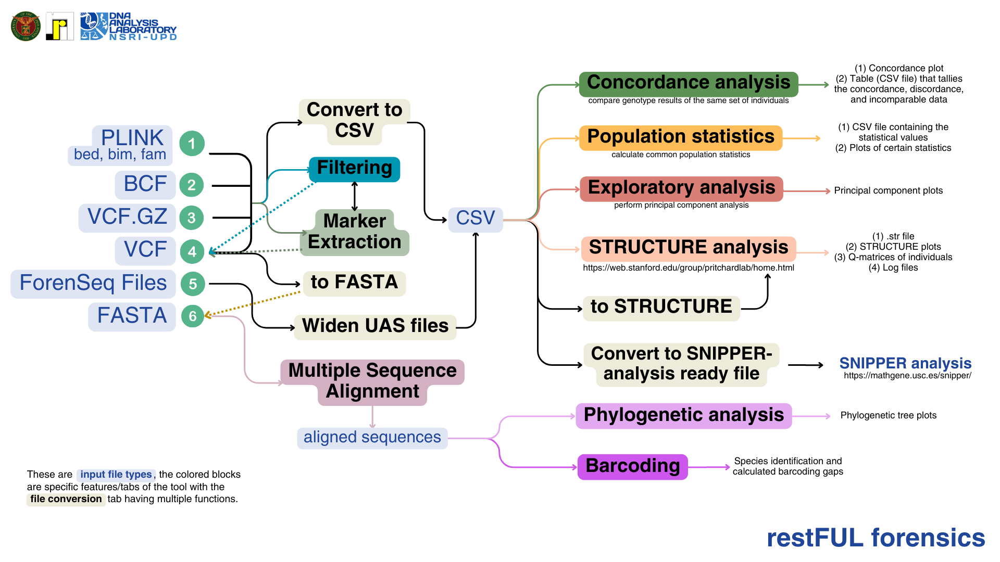

# restful-forensics-shinyapp
The Windows implementation of restful-forensics in RStudio. To check the dockerized application, see https://github.com/NSRI-DAL-2025-Project/restful-forensics.

For feedback on the tool, please fill up this google form: https://forms.gle/fA62Kwb2Ah2pC12H7

## I. Installation (installing without Docker)

### From the terminal

Clone the repository. Make sure that git is installed.

```         
git clone https://github.com/NSRI-DAL-2025-Project/restful-forensics.git
```

### Using RStudio

-   Under File \> New Project \> Version Control \> Git
-   Under Repository URL, paste:
    "<https://github.com/NSRI-DAL-2025-Project/restful-forensics.git>"

Open the "app.R" file and click the "Run App" button on the top right
corner of the source panel. 

Note: Some functionalities require a Linux OS. A Windows-compatible
version will be linked here once available.


## II. Features

This application is used for the pre-processing of standard genetic data
files (VCF, VCF.GZ, BCF, PLINK files, and FASTA) and analysis to an
extent. The following tabs are available and offers certain
functionalities.



### 🔄 File Conversion
This tab has multiple features dedicated to converting file types to a different data structure structure.


**_A. Convert files to CSV_**

This tab converts genetic data files to a
commonly used file in downstream analysis. Population data is required
and will be merged with the genetic data file based on the sample value
(therefore it assumes the sample name is the same for both files.)

The output of this file can directly be used in the calculation of
population statistics, Principal Component Analysis, STRUCTURE analysis,
and other tools not included in this toolkit.


**_B. Widen ForenSeq UAS files_**

This tab is specific to the work at the DNA
Analysis Laboratory and to laboratories using the ForenSeq DNA Signature
Prep Kit. It builds upon the work of the Filipino Genomes Research
Program 2. The output is similar to the first tab.


**_C. VCF to FASTA_**

This tab converts VCF files to FASTA and requires a
reference file genome. The output can be used for multiple sequence
alignment.  
**Known Issue/s**: Uses BCFtools which is not compatible with Windows.


**_D. Convert to SNIPPER-analysis ready file_**

This tab is specific to the
ancestry work at the DNA Analysis Laboratory.


**_E. CSV to STRUCTURE file_**

This tab converts a processed CSV file (similar
to the output of tab A) to a STRUCTURE (.str) file that can be used in
STRUCTURE v2.3.4 or other tools such as StrAuto or faststructure.


### 🧬 SNP Extraction

**_A. SNP Extraction_**

This tab is specific for extracting markers via their
GRCh37/GRCh38 position or their Reference SNP cluster ID (rsID). The
extracted files can be processed in file conversion to generate an
analysis-ready file.  
**Known Issue/s**: Uses BCFtools for merging zipped VCF files (vcf.gz) not compatible with Windows.


**_B. Concordance Analysis_**

This tab compares the sequencing outputs of two
different technologies. It expects either an XLSX or CSV file containing
sample and marker information.  
**Known Issue/s**: Takes a significant amount of time to load the results (table and plots)

### 🔽 Filtering

This tab is dedicated for the filtering of variants and/or samples in a
genetic data file. Standard filtering options are given, but there is an
option of specifying additional PLINK flags. Certain genetic data files
have no information on the depth of coverage (DC) which is commonly
included in VCF files. Hence, plotting of DC is available only for VCF
files.

This outputs a VCF file that can be further processed under the "File
Conversion" tab and used for further analysis.

Standard filtering flags included:  
--mind  
--geno  
--maf  
--qual-threshold  
--hwe  
--indep-pairwise  

PLINK 1.9 flag options: https://www.cog-genomics.org/plink/


### ↔️ Multiple Sequence Alignment

This tab accepts zipped FASTA files and performs sequence alignment
using the msa R package. The post-processing of the alignment is
performed using the DECIPHER package. Two functions, AdjustAlignment()
and StaggerAlignment() is used and provided as an option for
phylogenetic tree construction.
**Known Issue/s**: PDF of the alignment is automatically being downloaded in the working directory of the repository.  
Output is not properly appearing using the shiny app.

### 🌲Phylogenetic Tree

This tab automatically accepts the alignment from the previous tab to
build a phylogenetic tree using the common approaches (NJ, UPGMA,
Maximum Parsimony, and Maximum Likelihood).  
**Known Issue/s**: Occasionally throws an error that requires fsnps_gen() which is used in other functions.

### 📑 Barcoding (*not yet tested)

This uses the BarcodingR package for species identification and to calculate and evaluate barcoding gaps.  
Link to the manual: https://cran.r-project.org/web/packages/BarcodingR/BarcodingR.pdf

**_A. Species Identification_**  

This subtab uses aligned reference and query sequences (should be the same length) for species identification.  
There is an option to additionally utilize the kmer method. The functions used are ```barcoding.spe.identify```,  
```barcoding.spe.identify2```, and ```bbsik```.  

- ```barcoding.spe.identify``` used for protein-coding barcodes. Methods 'bpNewTraining' is used to make direct species identification for relatively small datasets (<500 samples), 'bpNewTrainingOnly' for COI barcode data with >500 samples (first run) and then 'bpUseTrained' for the second run. Other two options are 'fuzzyId' and 'Bayesian'
- ```barcoding.spe.identify2``` used for non-protein-coding barcodes.
- ```bbsik``` used for both protein-coding and non-coding barcodes using kmer statistics.  

**_B. Optimize kmer values_**  

Calculates the optimal kmer value per dataset (can be query or reference). It outputs a plot indicating the optimal value.

**_C. Barcoding Gap_**  

Calculates the DNA barcoding gap using any of the following methods: K2P distance, euclidean, or raw.

**_D. Evaluate Barcodes_**  

Evaluates two barcodes using species identification success rate criteria. Kmer values can be identified by first running 'Optimize kmer values'.  

**_E. Species Membership Value (TDR)_**  

Calculates the TDR value for a set of queries and one potential species.


For Automatic Barcode Gap Discovery, several iTaxoTools webtool/webserver implementations are accessible:  
- iTaxoTools Galaxy webserver: http://galaxy.itaxotoolsweb.org/
- Muséum national d'Histoire naturelle (MNHN) webserver: https://bioinfo.mnhn.fr/abi/public/abgd/

For complete links and information, access iTaxoTools using https://itaxotools.org/links.

### 📝 Population Statistics

This accepts a processed file similar to the output of the "Convert
files to CSV" tab to calculate the common population statistics. 

**For guidance on interpreting the following, see the references**

[1] Private alleles (poppr package)  
[2] Mean Allelic Richness (hierfstat package)  
[3] Heterozygosity (hierfstat package)  
[4] Inbreeding Coefficient (hierfstat package)  
[5] Allele Frequency (adegenet package)  
[6] Hardy-Weinberg Equilibrium (pegas package)  
[7] FST values (hierfstat package)  
**Known Issue/s**: Takes a significant amount of time to load the results (table and plots).


### 🔍 Exploratory Analysis

This tab performs principal component analysis (PCA) on a pre-processed data in CSV or XLSX format using the ade4 R package. This accepts a processed file similar to the output of the "Convert
files to CSV" tab. Labels and colors can be personalized. 


### 📊 STRUCTURE Analysis

This tab explores population structure using the STRUCTURE v2.3.4 software. 

Parameters required:
- Min and Max K 
- Replicates per K
- Burnin-in Period
- MCMC reps after burn-in
- Admixture model (assumed False)
- Phased genotypes (assumed False)
- Linkage Model (assumed False)
- Ploidy level (assumed 2)

To explore STRUCTURE v2.3.4: https://web.stanford.edu/group/pritchardlab/structure_software/release_versions/v2.3.4/html/structure.html

> This toolkit adapted functions from strataG [8] and dartR [9] R packages.
> The following functions were adapted and revised: 'gl.run.structure', '.structureParseQmat', 'structureRead', and 'utils.structure.evanno'.

**Known Issue/s**: Takes a significant amount of time to load the results (zipped files and plots).


### References
[1] Petit, R.J., El Mousadik, A., and Pons, O. (1998). Identifying populations for conservation on the basis of genetic markers. Conservation Biology, 12:844-855  
[2] Foulley, J.F., and Ollivier, L. (2005). Estimating allelic richness and its diversity. Livestock Science, 101:150-158. https://doi.org/10.1016/j.livprodsci.2005.10.021  
[3] Nei, M. (1978). Estimation of average heterozygosity and genetic distance from a small number of individuals. Genetics:89:583-590. https://doi.org/10.1093/genetics/89.3.583  
[4] Rousset, F. (2002). Inbreeding and relatedness coefficients: what do they measure? Heredity, 88:371-380  
[5] Rezaei, N., and Hedayat, M. (2013). Allele Frequency. Brenner's Encyclopedia of Genetics (Second Edition). https://doi.org/10.1016/B978-0-12-374984-0.00032-2  
[6] Tiret, L., and Cambien, F. (1995). Departure from Hardy-Weinberg equilibrium should be systematically tested in studies of association between genetic markers and disease. Circulation, 92(11):3364-3365.  
[7] Weir, B.S., and Cockerham, C.C. (1984). Estimating F-statistics for the analysis of population structure. Evolution; International Journal of Organic Evolution, 38(6): 1358-1370. https://doi.org/10.1111/j.1558-5646.1984.tb05657.x  
[8] Archer, F., Adams, P., and Schneiders, B. (2016). strataG: an R package for manipulating, summarizing, and analyzing population genetic data. Molecular Ecology Resources 17: 5-11. https://doi.org/10.1111/1755-0998.12559  
[9] Gruber, B., Unmack, P.J., Berry, O.F., and Georges, A. (2018). dartR: an R package to facilitate analysis of SNP data generated from reduced representation genome sequencing. Molecular Ecology Resources 18:691-699. https://doi.org/10.1111/1755-0998.12745  
