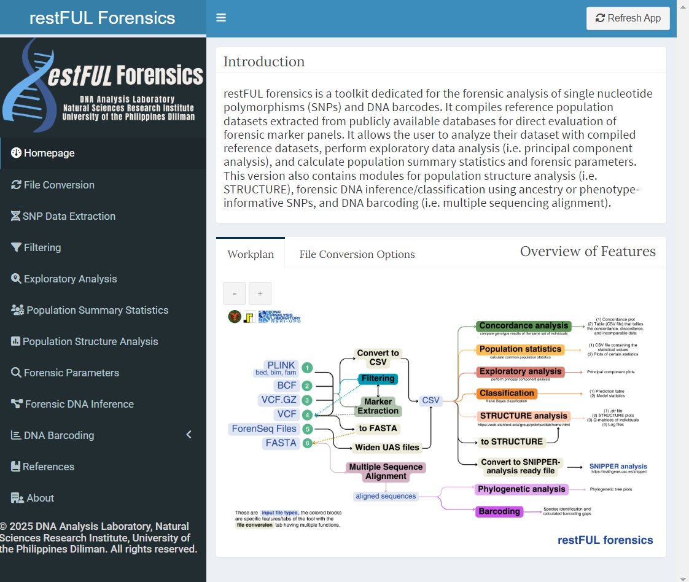
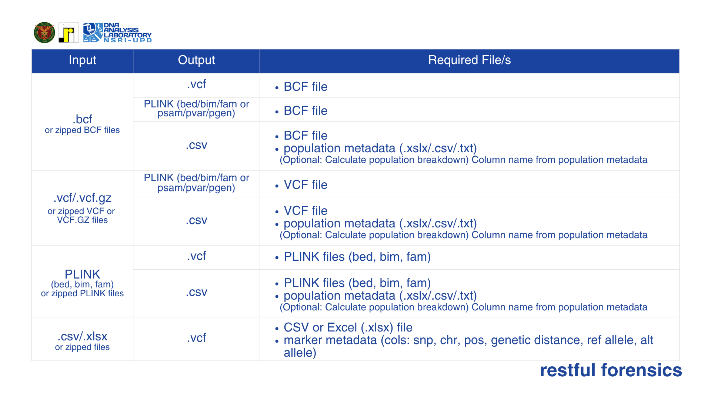

# restful-forensics-shinyapp
The Windows implementation of restful-forensics in RStudio. To check the dockerized application, see https://github.com/NSRI-DAL-2025-Project/rstudio-shiny-verse-opencpu-dependencies-restful-forensics.

For feedback on the tool, please fill up this google form: https://forms.gle/fA62Kwb2Ah2pC12H7

## I. Installation (installing without Docker)

Ensure that R is installed in the system then run the following:
```
shiny::runGitHub("restful-forensics-shinyapp", "NSRI-DAL-2025-Project")
```

The shiny application will look like this:



## II. Features

This application is used for the pre-processing of standard genetic data
files (.vcf, .vcf.gz, .bcf, PLINK files (.bed, .bim, .fam), and FASTA files) and analysis to an
extent. The following tabs are available and offers certain
functionalities.


### 🔄 File Conversion
This tab has multiple features dedicated to converting file types to a different data structure structure.


**_A. Convert files_**

This tab converts genetic data files to a
commonly used file in downstream analysis. If converting to CSV, 
population data is required and will be merged with the genetic 
data file based on the sample value (therefore it assumes the 
sample name is the same for both files.)

Conversion options:
- VCF starting file to PLINK files, CSV, or FASTA file.
- BCF starting file to PLINK files, CSV, or VCF file.
- PLINK starting files to CSV or VCF file.
- CSV starting file to VCF file.

The output of this file can directly be used in the calculation of
population statistics, Principal Component Analysis, STRUCTURE analysis,
and other tools not included in this toolkit.


**_B. ForenSeq Conversion_**

This tab is specific to the work at the DNA
Analysis Laboratory and to laboratories using the ForenSeq DNA Signature
Prep Kit. It builds upon the work of the Filipino Genomes Research
Program 2. The output is similar to the first tab.


**_C. Convert to SNIPPER analysis-ready file_**

This tab is specific to the
ancestry work at the DNA Analysis Laboratory.


**_D. To STRUCTURE file_**

This tab converts a processed CSV file (similar
to the output of tab A) to a STRUCTURE (.str) file that can be used in
STRUCTURE v2.3.4 or other tools such as StrAuto or faststructure.


### 🧬 SNP Data Extraction

**_A. SNP Data Extraction_**

This tab is specific for extracting markers via their
GRCh37/GRCh38 position or their Reference SNP cluster ID (rsID). The
extracted files can be processed in file conversion to generate an
analysis-ready file. The functions would convert the input files to .pgen files
for PLINK2.0 compatibility.


**_B. Concordance Analysis_**

This tab compares the sequencing outputs of two
different technologies. It expects either an Excel (.xlsx) or CSV file containing
sample and marker information.  

### 🔽 Filtering

This tab is dedicated for the filtering of variants and/or samples in a
genetic data file. Standard filtering options are given, but there is an
option of specifying additional PLINK flags. Certain genetic data files
have no information on the depth of coverage (DC) which is commonly
included in VCF files. Hence, plotting of DC is available only for VCF
files.

This outputs a VCF file that can be further processed under the "File
Conversion" tab and used for further analysis.

Standard filtering flags included:  
--mind  
--geno  
--maf  
--qual-threshold  
--hwe  
--indep-pairwise  
 
PLINK 1.9 flag options: https://www.cog-genomics.org/plink/  

### 🔍 Exploratory Analysis

This tab performs principal component analysis (PCA) on a pre-processed data in .csv or .xlsx file format using the ade4 R package. This accepts a processed file similar to the output of the "Convert
files to CSV" tab. Labels and colors can be personalized. 


### 📝 Population Statistics

This accepts a processed file similar to the output of the "Convert
files to CSV" tab to calculate the common population statistics. 

**For guidance on interpreting the following, see the references**

[1] Private alleles (poppr package)  
[2] Mean Allelic Richness (hierfstat package)  
[3] Heterozygosity (hierfstat package)  
[4] Inbreeding Coefficient (hierfstat package)  
[5] Allele Frequency (adegenet package)  
[6] Hardy-Weinberg Equilibrium (pegas package)  
[7] FST values (hierfstat package)  
**Known Issue/s**: Takes a significant amount of time to load the results (table and plots).


### Forensic Parameters (iiSNPs)

This tab calculates common forensic parameters for individual identity SNPs (iiSNPs): random match probability (RMP), 
power of discrimination (PD), polymorphic information content (PIC), power of exclusion (PE),
and typical paternity index (TPI).


### ↔️ Multiple Sequence Alignment

This tab accepts zipped FASTA files and performs sequence alignment
using the msa R package. The post-processing of the alignment is
performed using the DECIPHER package. Two functions, AdjustAlignment()
and StaggerAlignment() is used and provided as an option for
phylogenetic tree construction.
**Known Issue/s**: PDF of the alignment is automatically being downloaded in the working directory of the repository.  


### 🌲Phylogenetic Tree

This tab automatically accepts the alignment from the previous tab to
build a phylogenetic tree using the common approaches (Neighbor Joining (NJ), Unweight Pair Group Method using Arithmetic averages (UPGMA), Maximum Parsimony, and Maximum Likelihood).  

### 📑 Barcoding (*untested)

This uses the BarcodingR package for species identification and to calculate and evaluate barcoding gaps.  
Link to the manual: https://cran.r-project.org/web/packages/BarcodingR/BarcodingR.pdf

**_A. Species Identification_**  

This subtab uses aligned reference and query sequences (should be the same length) for species identification.  
There is an option to additionally utilize the kmer method. The functions used are ```barcoding.spe.identify```,  
```barcoding.spe.identify2```, and ```bbsik```.  

- ```barcoding.spe.identify``` used for protein-coding barcodes. Methods 'bpNewTraining' is used to make direct species identification for relatively small datasets (<500 samples), 'bpNewTrainingOnly' for COI barcode data with >500 samples (first run) and then 'bpUseTrained' for the second run. Other two options are 'fuzzyId' and 'Bayesian'
- ```barcoding.spe.identify2``` used for non-protein-coding barcodes.
- ```bbsik``` used for both protein-coding and non-coding barcodes using kmer statistics.  

**_B. Optimize kmer values_**  

This subtab calculates the optimal kmer value per dataset (can be query or reference). It outputs a plot indicating the optimal value.

**_C. Barcoding Gap_**  

This subtab calculates the DNA barcoding gap using any of the following methods: K2P distance, euclidean, or raw.

**_D. Evaluate Barcodes_**  

This subtab evaluates two barcodes using species identification success rate criteria. Kmer values can be identified by first running 'Optimize kmer values'.  

**_E. Species Membership Value (TDR)_**  

This subtab calculates the TDR value for a set of queries and one potential species.


For Automatic Barcode Gap Discovery, several iTaxoTools webtool/webserver implementations are accessible:  
- iTaxoTools Galaxy webserver: http://galaxy.itaxotoolsweb.org/
- Muséum national d'Histoire naturelle (MNHN) webserver: https://bioinfo.mnhn.fr/abi/public/abgd/

For complete links and information, access iTaxoTools using https://itaxotools.org/links.


### 📊 Population Structure Analysis

This tab explores population structure using the STRUCTURE v2.3.4 software. 

Parameters required:
- Min and Max K 
- Replicates per K
- Burnin-in Period
- MCMC reps after burn-in
- Admixture model (assumed False)
- Phased genotypes (assumed False)
- Linkage Model (assumed False)
- Ploidy level (assumed 2)

To explore STRUCTURE v2.3.4: https://web.stanford.edu/group/pritchardlab/structure_software/release_versions/v2.3.4/html/structure.html

> This toolkit adapted functions from strataG [8] and dartR [9] R packages.
> The following functions were adapted and revised: 'gl.run.structure', '.structureParseQmat', 'structureRead', and 'utils.structure.evanno'.

**Known Issue/s**: Takes a significant amount of time to load the results (zipped files and plots).

### 🔍 Forensic Parameters

This tab calculates Forensic Parameters specific for individual identity SNPs:
- Random match probability (PM)  
- Power of discrimination (PD)  
- Polymorphism Information Content (PIC)  
- Power of Exclusion (PE)  
- Typical Paternity Index (TPI)  

Guidelines on [statistical calculations](https://dfs.dc.gov/sites/default/files/dc/sites/dfs/page_content/attachments/FBS22%20-%20STR%20Statistical%20Calculations%20Guidelines.pdf) for casework (for STR).  

Guidelines and interpretations: Based on the [STRAF book](https://agouy.github.io/straf_book/forensic-parameters.html)

### 🪪 Forensic DNA inference  

This tab classifies individuals using Naive Bayes from the e1071 and caret R packages.
It accepts a CSV/XLSX file with sample, population, and genotype information. 

